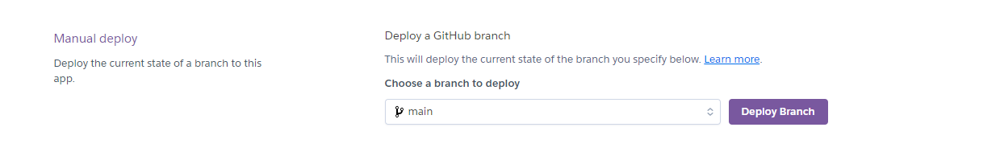

# Annual Waste Data Analyser 
Welcome to the annual waste data analyser. This is a command line applicatoin built with Python. This program is connected to a google sheet database which stores the data for a fictional waste collection company. The purpose of the program is to anaysle the data from the command line.

Access the program here - [Waste Data Analyser](https://waste-data-analyser-3742936dc8c7.herokuapp.com/)

## Responsive image

## User stories

### As a user I can use the  program to enter valid data into a spreadsheet from the command line
#### Acceptance Criteria:
- Enter data via the CLI
- Ensure the data is validated appropriately
- The data is saved into the spreadsheet
#### Tasks:
- Create an input option for the program
- Create validation parameters for the data 
- Link the sheet via an API to the program to save all data entered 

### As a user I can use the  program to analyse how much profit the waste collecors made 
#### Acceptance Criteria:
- Allow the user to see how much profit was made
#### Tasks:
- Create functions that calculate the tonnes collected with the price list to find the profit
- display the profit to the user

## How it works
- The user starts the program and encounters the main menu
- The user can select data entry or to calulate profit
    ### Data entry
    - Select one of three worksheets to enter data for
    - Once the data has been entered the sheet cannot be edited again( Data must be a positive integer)
    - User can navigate back to main menu and profit calculation section
    ### Calculate profit
    - User can select one of three worksheets to calculate profit for
    - Initial calcualtion will take several minutes
    - Upon calculation the sheet will be printed out for the user to view including the profit that was calcualted based on the total tonneage multiplied by a price per tonne that is found in the worksheet.
    
## Agile Methodologies
### GitHub Projects
Link to the GitHub project page that was used to manage the website build. Items were added to the kanban board and worked through. Items were linked to the project repo and closed off as the project progressed. [github project board](https://github.com/users/fergal92/projects/3/views/1)

## Features
### Existing Features
#### Main menu
- Simple terminal menu has been incorporated into the project to ensure seamless and consistent navigation 

#### Data Entry
- The user can input data into the spreadsheet in order to complete the annual waste collection data.
- The user is prompted to enter data 4 times as this corresponds to the monthly data for each waste type
- This data input is validated so that they cannot enter a negative number and they can enter a positive integer up to 400 Tonnes. 400 Tonnes is the upper limit of what the program expects
- When the user completes a successful data input of all 4 waste types, the current worksheet with the newly entered data is printed to the terminal to show the user where they are at

#### Calculate Profit
- The user can choose to calculate the profit for one of the three collector sheets.
- The profit cannot be calculated unless the waste data has been entered for the year. There is a validation in place for that
- The total waste collected and total profit for the year is calculated and input into the sheet
- At the end of the profit calculation the current worksheet is printed to the terminal to show the user the profit

### Features left to implement 
#### Data analysis
- More comprehensive data analysis features could be implemented to add further value to this project.
- Graphs could be added to visualise the data.
- Python packages like Pandas and matplotlib could be utilised to achieve this outcome.
## Technologies Used
- [Python](https://www.python.org/) - was used as the language to buildt this project
- [Time Module](https://docs.python.org/3/library/time.html) - Tiem module was used to control the time it took to write data to the spreadsheet
- [Gspread](https://docs.gspread.org/en/v6.0.1/) - was used to simplify interaction with Google Sheets.
- [Google Sheets API](https://developers.google.com/sheets/api/guides/concepts) - was used to interact with Google Sheets for data 
- [Tabulate](https://pypi.org/project/tabulate/) - was used to format
- [Simple Terminal Menu](https://pypi.org/project/simple-term-menu/) - Used to build navigation menu in the project
- [art](https://pypi.org/project/art/) - Used to build computer art for the project
- [colorama](https://pypi.org/project/colorama/) - Used to provide color to the project
- [GitPod](https://www.gitpod.io/) - was used as the main tool to write and edit code.
- [Git](https://git-scm.com/) - was used for the version control of the website.
- [GitHub](https://github.com/) - was used to host the code of the website.
- [Am I Responsive](https://ui.dev/amiresponsive) - was used to generate an image of the website across different screen types and resolutions
- [Heroku](https://id.heroku.com/login) - Was used to deploy and host the project
- [ASCII Art](https://www.asciiart.eu/) - ASCII art was used to create the welcome page for the project

## Testing
Please refer to the [TESTING.md](TESTING.md) file for all testing documentation
## Deployment

### Deployment to Heroku
The heroku app was deployed at the beginning of the project to ensure any issues were encountered early and could be resolved.

The application has been deployed using Heroku by following these steps:

The application has been deployed using [Heroku](https://dashboard.heroku.com/) by following these steps:

1. Create the requirements.txt file and run: pip3 freeze > requirements.txt in the console.
2. Commit changes and push them to GitHub.
3. Go to the Heroku's website.
4. From the Heroku dashboard, click on "Create new app". 
5. Enter the "App name" and "Choose a region" before clicking on "Create app".
6. Go to "Config Vars" under the "Settings" tab.
7. Click on "Reveals Config Vars" and add the KEY: CREDS and the VALUE stored in creds.json file if needed. 
8. Add the Config Var, KEY: PORT and VALUE: 8000.
9. Go to "Buildpacks" section and click "Add buildpack". 
10. Select "python" and click "Save changes"
11. Add "nodejs" buildpack as well using the same process.
12. Go to "Deployment method", under the "Deploy" tab select "GitHub" and click on "Connect to GitHub".
13. Go to "Connect to GitHub" section and "Search" the repository to be deployed.
14. Click "Connect" next the repository name.
15. Choose "Manual deploys" to deploy your application. 
16. Apply for student credits and then apply ECO Dynos. 
17. Manually deploy the project in Heroku once changes have been made to the repository

The live link to the site can be found [here](https://waste-data-analyser-3742936dc8c7.herokuapp.com/)

## Future improvements
- As noted in the features left to implement section, the project could certainly be improved by adding more data analysis features and by adding graphing and visualisation features

## Credits
This project would not have been possible without the use of various libraries, packages, and tools. Below is a list of technologies and resources that were instrumental in the development of this project:

### Code Institute - Love Sandwiches Project
I used this project as inspiration for my project. I based some of my functions and methodology on this project and want to awknowledge this project as the main source of inspiration for my project

### Libraries and Packages
- Python: The core programming language used to develop this project.
- Time Module: Used to manage time-related functions and delays during data operations.
- OS Module: Utilized for operating system-related functions, such as clearing the terminal screen.
- Gspread: Simplified interaction with Google Sheets API, allowing easy data manipulation.
- Google OAuth2: Used for authentication and authorization with Google services.
- Tabulate: Helped format and display data in a tabular format within the terminal.
- Simple-Term-Menu: Provided a simple text-based menu for user interactions.
- Art: Enabled the creation of ASCII art for the welcome screen.
- Colorama: Added color to the terminal output, enhancing the user experience.
### Development Tools
- GitPod: Used as the primary development environment for writing and editing code.
- Git: Employed for version control, allowing tracking of changes and collaboration.
- GitHub: Hosted the project's code repository and facilitated version control and collaboration.
### Deployment and Hosting
- Heroku: Used to deploy and host the project, making it accessible online.
### Additional Resources
- ASCII Art: Provided inspiration and examples for the ASCII art used in the welcome screen.
- Google Sheets: Served as the data storage solution for waste data, allowing easy access and manipulation via the API.

Special thanks to the creators and maintainers of these tools and libraries, as their work has been invaluable in bringing this project to life.

## Acknowledgements
- [Iuliia Konovalova](https://github.com/IuliiaKonovalova) - My mentor Julia was very supportive during this project. She certainly pushed me to complete a high standard of project especially for the readme and testing sections. I took inspiration from her README.md and TESTING.md files for my own.
- [Happiness Generator](https://github.com/broken-helix/happiness/) - My first hackathon project. I learned so much from participating in this project and team. We won the March hackathon for 2024 and my team members were a great source of inspiration for me.