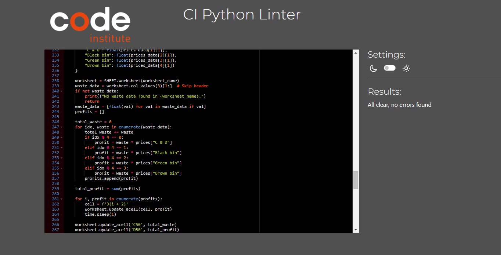

# Testing

run.py has an empty line at the end even though it is not on github

## Validation
The code was vailidated using the CI Pep8 Linter with no issues

## Manual testing
### Manual Testing Results

All manual tests were conducted successfully with no issues encountered. The table below summarizes the results:

| Test Case                          | Steps                                                                                                                         | Expected Results                                                                                                            | Actual Results | Status    |
|------------------------------------|-------------------------------------------------------------------------------------------------------------------------------|-----------------------------------------------------------------------------------------------------------------------------|----------------|-----------|
| **Data Entry**                     | 1. Launch the application.                                                                                                     | The application accepts valid data and updates the worksheet.                                                               | As expected    | Passed    |
|                                    | 2. Select "Data Entry" from the main menu.                                                                                     | Duplicate entries for the same month are not allowed.                                                                       | As expected    | Passed    |
|                                    | 3. Choose a worksheet (e.g., "collector-a").                                                                                   | The Google Sheet reflects the correct data.                                                                                 | As expected    | Passed    |
|                                    | 4. Enter valid waste data.                                                                                                     |                                                                                                                             |                |           |
|                                    | 5. Verify data is updated.                                                                                                     |                                                                                                                             |                |           |
|                                    | 6. Try entering data again for the same worksheet.                                                                             |                                                                                                                             |                |           |
|                                    | 7. Check the Google Sheet for correct data.                                                                                    |                                                                                                                             |                |           |
| **Data Validation**                | 1. Launch the application.                                                                                                     | The application displays error messages for invalid inputs.                                                                 | As expected    | Passed    |
|                                    | 2. Select "Data Entry" from the main menu.                                                                                     | The application prompts the user to re-enter valid data.                                                                    | As expected    | Passed    |
|                                    | 3. Choose a worksheet (e.g., "collector-a").                                                                                   |                                                                                                                             |                |           |
|                                    | 4. Enter invalid data (negative numbers, values above 400).                                                                    |                                                                                                                             |                |           |
|                                    | 5. Enter non-integer values.                                                                                                   |                                                                                                                             |                |           |
| **Profit Calculation**             | 1. Launch the application.                                                                                                     | The application calculates the profit accurately based on the input data and updates the worksheet.                         | As expected    | Passed    |
|                                    | 2. Select "Calculate Profit" from the main menu.                                                                               | Profit calculation is prevented if all data for the year is not entered.                                                    | As expected    | Passed    |
|                                    | 3. Choose a worksheet (e.g., "collector-a").                                                                                   | Duplicate profit calculations are not allowed.                                                                              | As expected    | Passed    |
|                                    | 4. Verify profit calculation.                                                                                                  |                                                                                                                             |                |           |
|                                    | 5. Ensure prevention of profit calculation without full data.                                                                  |                                                                                                                             |                |           |
|                                    | 6. Check Google Sheet for correct profit update.                                                                               |                                                                                                                             |                |           |
|                                    | 7. Attempt to recalculate profit for the same worksheet.                                                                       |                                                                                                                             |                |           |
| **Display Worksheet Data**         | 1. Launch the application.                                                                                                     | The worksheet data is displayed correctly and formatted as a green table.                                                   | As expected    | Passed    |
|                                    | 2. Select "Calculate Profit" from the main menu.                                                                               | The accompanying text is displayed in yellow.                                                                               | As expected    | Passed    |
|                                    | 3. Choose a worksheet (e.g., "collector-a").                                                                                   |                                                                                                                             |                |           |
|                                    | 4. Verify worksheet data display.                                                                                              |                                                                                                                             |                |           |
| **Main Menu Navigation**           | 1. Launch the application.                                                                                                     | The main menu options navigate to their respective functionalities correctly.                                               | As expected    | Passed    |
|                                    | 2. Use the terminal menu to navigate between options.                                                                          | The application exits gracefully when "Exit" is selected.                                                                   | As expected    | Passed    |
|                                    | 3. Verify each option's functionality.                                                                                         |                                                                                                                             |                |           |
|                                    | 4. Test the "Exit" option.                                                                                                     |                                                                                                                             |                |           |
| **Error Handling and Messages**    | 1. Perform various invalid operations.                                                                                        | Error messages are displayed in red.                                                                                        | As expected    | Passed    |
|                                    | 2. Verify error message display.                                                                                               | Success messages are displayed in green.                                                                                    | As expected    | Passed    |
|                                    | 3. Ensure appropriate success and info messages.                                                                               | Informational messages are displayed in yellow.                                                                             | As expected    | Passed    |

All tests passed successfully, confirming that the application performs as expected in various scenarios and handles errors appropriately.